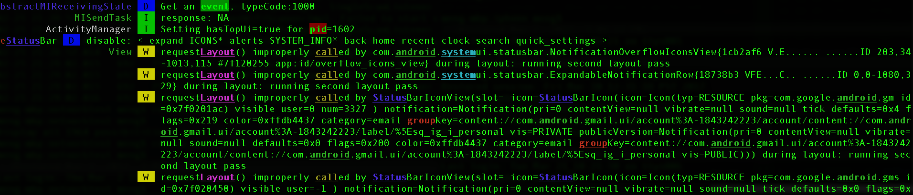

PID Cat (extended)
==================

An update to Jake Wharton's excellent [pidcat][1] which filters `adb`
result by application package name.
```bash
    pidcat com.oprah.bees.android
```
On top of this, this fork will mainly provide these additional features
 * `--timestamp`: add timestamp at the front of each line
 * `--grep`, `--hl`, `--grepv`: grep, highlight or exclude lines.
                        These options particularly consider the
                        line cutting issue in `pidcat`.
                        This script will grep lines before `pidcat`
                        cuts the original `adb` output line so as to
                        not miss any lines in grepping. Moreover, you can
                        specify different colors for each word in these
                        options, which is very helpful in checking different
                        word terms in massive log in sophisticated debugging.
                        The supported color names (case ignored) are
                        `BLACK, RED, GREEN,
                        YELLOW, BLUE, MAGENTA, CYAN,
                        WHITE, BG_BLACK, BG_RED, BG_GREEN, BG_YELLOW, BG_BLUE,
                        BG_MAGENTA, BG_CYAN, BG_WHITE`.
                        The color names with prefix 'BG_' are background colors.
                        Corresponding case-ignored options are also
                        provided: `--igrep`, `--ihl`, `--igrev`
 * `--header-width`: if customized header added in each log line besides Android headers, this option can help indent additional space for each wrapped lines
 * `--tee`, `--tee-original`: it supports to output the filtered and un-filtered `pidcat` result to specified files, which is useful for checking later
 * `--pipe`: it supports the script running in a pipe mode. For example, ``adb -d logcat | pidcat --pipe `tput cols`
                        com.testapp``. This is very useful if you want to use 3rd party tool to filter adb output, such as grepping, highlighting. For example, ``adb -d logcat
                        | h -i 'battery' | pidcat --pipe `tput cols`
                        com.testapp``. [`h`][2] is a keyword highlighting utility. The option needs the current terminal width provided as the parameter, which is easy to get in shell using command `` `tput cols` ``.

Here is an example of the output of the following command:
```bash
    pidcat --timestamp --ihl='oslog|logs|sensor\cyan|queuebatch\bg_blue|state\white|latency\bg_green|enable\magenta' --hl='screen\yellow|far\bg_yellow|event\bg_ack'
```


Another example using pipe mode with 3rd-party [`h`][2] tool:
```bash
    adb logcat | h group android call Status Layout system pid event | pidcat --pipe=`tput cols`
```


You could notice that
 * The words are highlighted in specified colors, even the cut words due to line wrapping (`--hl`);
 * Timestamps are headed in each line (`--timestamp`);
 * Additional indentation spaces are added to align the wrapped lines to the right of timestamp headers (`--header-width`);

Here are details of all additional options provided:
<pre>
  --timestamp           Prepend each line of output with the current time.
  --extra-header-width N
                        Width of customized log header. If you have your own
                        header besides Android log header, this option will
                        further indent your wrapped lines with additional
                        width
  --grep GREP_WORDS     Filter lines with words in log messages. The words are
                        delimited with '|', where each word can be tailed with
                        a color initialed with '\'. If no color is specified,
                        'RED' will be the default color. For example, option
                        --grep='word1|word2\CYAN' means to filter out all
                        lines containing either 'word1' or 'word2', and
                        'word1' will appear in default color 'RED', while
                        'word2' will be in the specified color 'CYAN'.
                        Supported colors (case ignored): {BLACK, RED, GREEN,
                        YELLOW, BLUE, MAGENTA, CYAN, WHITE, BG_BLACK, BG_RED,
                        BG_GREEN, BG_YELLOW, BG_BLUE, BG_MAGENTA, BG_CYAN,
                        BG_WHITE, NONE}. The color with prefix 'BG_' is
                        background color. And color 'NONE' means NOT
                        highlighting with color. You can have multiple '--
                        grep' options in the command line, and if so, the
                        command will grep all of the key words in all '--grep'
                        options. Escape '|' with '\|', and '\' with '\\'.
  --hl HIGHLIGHT_WORDS  Words to highlight in log messages. Unlike '--grep'
                        option, this option will only highlight the specified
                        words with specified color but does not filter any
                        lines. Except this, the format and supported colors
                        are the same as '--grep'. You can have multiple '--hl'
                        options in the command line, and if so, the command
                        will highlight all of the key words in all '--hl'
                        options
  --grepv GREPV_WORDS   Exclude lines with words from log messages. The format
                        and supported colors are the same as '--grep'. Note
                        that if both '--grepv' and '--grep' are provided and
                        they contain the same word, the line will always show,
                        which means '--grep' overwrites '--grepv' for the same
                        word they both contain. You can have multiple '--
                        grepv' options in the command line, and if so, the
                        command will exclude the lines containing any keywords
                        in all '--grepv' options
  --igrep IGREP_WORDS   The same as '--grep', just ignore case
  --ihl IHIGHLIGHT_WORDS
                        The same as '--hl', just ignore case
  --igrepv IGREPV_WORDS
                        The same as '--grepv', just ignore case
  --keep-all-fatal      Do not filter any fatal logs from pidcat output. This
                        is quite helpful to avoid ignoring information about
                        exceptions, crash stacks and assertion failures
  --tee FILE_NAME       Besides stdout output, also output the filtered result
                        (after grep/grepv) to the file
  --tee-original ORIGINAL_FILE_NAME
                        Besides stdout output, also output the unfiltered
                        result (all pidcat-formatted lines) to the file
  --tee-adb ADB_OUTPUT_FILE_NAME
                        Output original adb result (raw adb output) to the
                        file
  --pipe TERMINAL_WIDTH_FOR_PIPE_MODE
                        Note: you need to give terminal width as the value,
                        just put `tput cols` here. When running in pipe mode,
                        the script will take input from 'stdin' rather than
                        launching adb itself. The usage becomes something like
                        "adb -d logcat | pidcat --pipe `tput cols`
                        com.testapp". This is very useful when you want to
                        apply any third-party scripts on the adb output before
                        pidcat cutting each line, like using 3rd-party scripts
                        to grep or hilight with colors (such as using 'ack' or
                        'h' command) to keywords. For example, "adb -d logcat
                        | h -i 'battery' | pidcat --pipe `tput cols`
                        com.testapp"
  --hide-header HIDE_HEADER_REGEX
                        Remove the header in each line that matches the
                        regular expression. Note that Android adb header is
                        NOT considered here. The parameter is regular
                        expression. When this option provided, the script will
                        match the head of each log line (not including the
                        Android adb header) with the regular expression, and
                        remove the matched header in the output. This is
                        useful when your own log has big long headers in each
                        line which you don't care and want to hide them from
                        the output. The regular expression syntax is in python
                        style as described in
                        'https://docs.python.org/2/library/re.html'. You can
                        specify multiple '--hide-header' options and if the
                        header matches any of them, it will be removed from
                        output
</pre>

Install
-------

Get the script:

 * Download the `pidcat.py` and place it on your PATH.


Make sure that `adb` from the [Android SDK][3] is on your PATH. This script will
not work unless this is that case. That means, when you type `adb` and press
enter into your terminal something actually happens.

To include `adb` and other android tools on your path:
```bash
    export PATH=$PATH:<path to Android SDK>/platform-tools
    export PATH=$PATH:<path to Android SDK>/tools
```
Include these lines in your `.bashrc`, `.zshrc` or `.bash_profile`.

*Note:* `<path to Android SDK>` should be absolute and not relative.

 [1]: https://github.com/JakeWharton/pidcat
 [2]: https://github.com/paoloantinori/hhighlighter
 [3]: http://developer.android.com/sdk/
