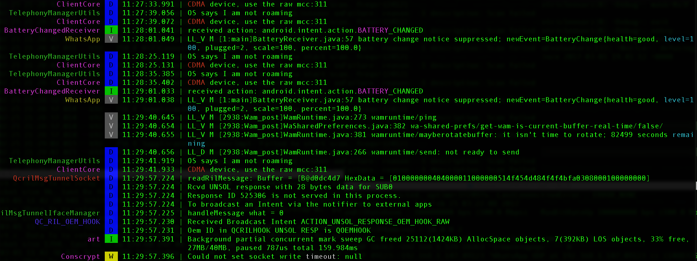

PID Cat
=======

An update to Jake Wharton's excellent [pidcat][1] which filters `adb` result by application package name.

    pidcat com.oprah.bees.android

On top of this, this fork will mainly provide these additional options
 * `--timestamp`: add timestamp at the front of each line
 * `--grep`, `--highlight`, `--grepv`: grep, highlight or exclude lines. These options particularly consider the line cutting issue in `pidcat` (it will grep lines before `pidcat` cut the original `adb` line for better format so that it won't miss any lines). Also you can specify different color for each word in these options, which is very helpful in checking massive log lines in sophisticated debugging. Corresponding case-ignored options are also provided: `--igrep`, `--ihighlight`, `--igrev`
 * `--header-width`: if customized header added in each log line besides Android headers, this option can help indent additional space for each wrapped lines
 * `--tee`, `--tee-original`: it supports to output the filtered and un-filtered `pidcat` result to specified files, which is useful for checking later

Here is an example of the output of the following command:

    pidcat --timestamp --header-width=15 --highlight="CDMA\|BATTERY\\magenta\|timeout\\white\|remaining\\cyan\|level=100\\cyan"



You could notice that
 * the words are highlighted in specified colors, even the cut words due to line wrapping (--highlight);
 * timestamps are headed in each line (--timestamp);
 * additional indentation are added to align the wrapped line to the right of timestamp header (--header-width);

Here are details of all additional options provided:
```
  --header-width N      Width of customized log header. If you have your own
                        header besides Android log header, this option will
                        further indent your wrapped lines with additional width
  --grep GREP_WORDS     Filter lines with words in log messages. The words are
                        delimited with '\|', where each word can be tailed
                        with a color initialed with '\\'. If no color is
                        specified, 'RED' will be the default color. For
                        example, option --grep="word1\|word2\\CYAN" means to
                        filter out all lines containing either word1 or word2,
                        and word1 will appear in default color RED while word2
                        will be in CYAN. Supported colors (case ignored):
                        {BLACK, RED, GREEN, YELLOW, BLUE, MAGENTA, CYAN,
                        WHITE}
  --highlight HIGHLIGHT_WORDS
                        Words to highlight in log messages. Unlike --grep
                        option, this option will only highlight the specified
                        words with specified color but does not filter any
                        lines. Except this, the format and supported colors
                        are the same as --grep
  --grepv GREPV_WORDS   Exclude lines with words from log messages. The format
                        and supported colors are the same as --grep. Note that
                        if both --grepv and --grep are provided and they
                        contain the same word, the line will always show,
                        which means --grep overwrites --grepv for the same
                        word they both contain
  --igrep IGREP_WORDS   The same as --grep, just ignore case
  --ihighlight IHIGHLIGHT_WORDS
                        The same as --highlight, just ignore case
  --igrepv IGREPV_WORDS
                        The same as --grepv, just ignore case
  --tee FILE_NAME       Besides stdout output, also output the filtered result
                        (after grep/grepv) to the file
  --tee-original ORIGINAL_FILE_NAME
                        Besides stdout output, also output the unfiltered
                        result (no grep/grepv, i.e., original adb output) to
                        the file

```

Install
-------

Get the script:

 * Download the `pidcat.py` and place it on your PATH.


Make sure that `adb` from the [Android SDK][2] is on your PATH. This script will
not work unless this is that case. That means, when you type `adb` and press
enter into your terminal something actually happens.

To include `adb` and other android tools on your path:

    export PATH=$PATH:<path to Android SDK>/platform-tools
    export PATH=$PATH:<path to Android SDK>/tools

Include these lines in your `.bashrc`, `.zshrc` or `.bash_profile`.

*Note:* `<path to Android SDK>` should be absolute and not relative.

 [1]: https://github.com/JakeWharton/pidcat
 [2]: http://developer.android.com/sdk/
